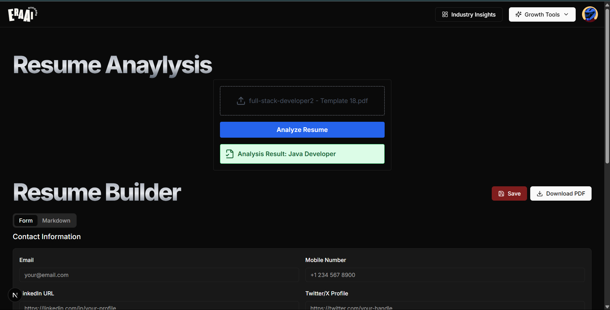

# EraAI - AI Career Assistant

A powerful and intelligent career coaching platform that leverages AI to help users navigate their career paths. Built with modern full-stack technologies, EraAI provides resume analysis, personalized career guidance, job matching, and more.

🌐 **Live Demo**: [https://era-ai-iota.vercel.app/](https://era-ai-iota.vercel.app/)

---

## 🚀 Features

* ✨ **AI-Driven Career Recommendations** (powered by Gemini API)
* 📝 **Resume Analysis & Builder** with AI suggestions
* 📩 **AI-Powered Cover Letter Generator**
* 🎯 **Skill Gap Analysis and Development Plans**
* 🎤 **Mock Interview Practice with Personalized Questions**
* 📊 **Real-Time Data Insights** via Prisma + Neon DB
* 🔒 **User Authentication & Onboarding** via Clerk
* ⚙️ **Automated Workflows & Background Jobs** with Inngest
* 💻 **Modern UI** with Tailwind CSS + Shadcn UI
* 🧠 **AI Resume Analyzer** – Instantly classifies your resume into career categories

---

## 🖼️ Resume Analyzer Preview

### 📝 Upload Interface


--- 


### ✅ Prediction Result



---


---

## 🛠️ Tech Stack

| Tech             | Usage                                  |
| ---------------- | -------------------------------------- |
| **Next.js**      | Full-stack React framework             |
| **Tailwind CSS** | Utility-first styling framework        |
| **Neon DB**      | Cloud PostgreSQL database              |
| **Prisma**       | ORM for managing DB schema & access    |
| **Inngest**      | Workflow orchestration, webhooks, CRON |
| **Shadcn UI**    | Elegant UI components                  |
| **Clerk**        | Authentication and session management  |
| **Gemini API**   | AI-driven recommendation engine        |
| **Flask**        | Python backend for AI resume analyzer  |

---

## 📁 Folder Structure

```

EraAI/
├── actions/                # Server actions
├── app/                    # Main Next.js app
│   ├── auth/               # Auth routes
│   ├── main/               # Main dashboard logic
│   ├── api/                # API routes
│   └── lib/                # Libs and utilities
├── components/             # UI components
├── data/                   # Static/mock data
├── hooks/                  # Custom React hooks
├── lib/                    # Helper libs (e.g., API utils)
├── prisma/                 # Prisma schema and migrations
├── public/                 # Static assets
├── resume-backend/         # Python Flask API + model & dataset
├── assets/                 # Screenshots for README
├── .env                    # Env vars
├── package.json            # Project dependencies
├── next.config.mjs         # Next.js config
└── tailwind.config.mjs     # Tailwind config

````

---

## 🔑 Prerequisites

* Node.js (v18+)
* Python 3.8+
* Clerk Account
* Neon DB Account
* Gemini API Key

---

## ⚙️ Setup Instructions

### 1. Clone the Repo

```bash
git clone https://github.com/ybthummar/EraAI.git
cd EraAI
````

### 2. Install Node Dependencies

```bash
npm install
```

### 3. Install Python Dependencies

Navigate to the `resume-backend/` folder:

```bash
cd resume-backend
pip install -r requirements.txt
```

### 4. Start Flask API (Resume Analyzer)

```bash
python app.py
```

Ensure it's running on `http://localhost:5000` (you can update if needed).

### 5. Connect Frontend to Flask API

Edit your `fetch` or `axios` calls in your Next.js app to hit:

```
http://localhost:5000/analyze-resume
```

### 6. Configure Environment Variables

Create a `.env` file in the root:

```env
DATABASE_URL=your-neon-db-url
NEXT_PUBLIC_CLERK_PUBLISHABLE_KEY=your-clerk-pk
CLERK_SECRET_KEY=your-clerk-sk

NEXT_PUBLIC_CLERK_SIGN_IN_URL=/sign-in
NEXT_PUBLIC_CLERK_SIGN_UP_URL=/sign-up
NEXT_PUBLIC_CLERK_AFTER_SIGN_IN_URL=/onboarding
NEXT_PUBLIC_CLERK_AFTER_SIGN_UP_URL=/onboarding

GEMINI_API_KEY=your-gemini-api-key
INNGEST_API_KEY=your-inngest-api-key
```

### 7. Set Up Prisma and Inngest

```bash
npx prisma generate
npx prisma migrate dev
npx inngest dev
```

### 8. Run the Application

```bash
npm run dev
```

The app will be available at `http://localhost:3000`

---

## 📦 Deployment

1. Ensure `.env` variables are filled with production credentials.
2. Run migrations:

```bash
npx prisma migrate deploy
```

3. Start Inngest:

```bash
npx inngest start
```

4. Deploy on **Vercel**:

   * Connect repo to Vercel
   * Add `.env` values in the Vercel dashboard
   * Deploy and you're live!
5. Deploy Flask API separately (e.g., on Render or Railway) and update URL in frontend.

---

## 📫 Contact

Made with 💡 by **Yug Thummar**
📧 [yugthummar001@gmail.com](mailto:yugthummar001@gmail.com)
🔗 [GitHub: ybthummar](https://github.com/ybthummar)

> EraAI is designed to supercharge your career — let AI lead the way 🚀
---

Let me know if you want me to generate the screenshots (mockups) or help you deploy your Flask backend to Render/Railway so it's accessible from Vercel.
```


